# Wildfire Cause Prediction

**Course:** INFO 6105 — Data Science Engineering Methods and Tools
**Institution:** Northeastern University, Spring 2026
**Team 6:** Akshay Govind | Varun Singh

---

## What This Is

24 years of US wildfire records. 1.88 million rows. One question: was this fire started by a person or by lightning?

This project builds a binary classifier on the USDA Forest Service fire database (1992-2015). The target is simple — human-caused (1) vs lightning-caused (0) — but the data is not. 83.8% of fires are human-caused, which means accuracy is a useless metric here. A model that predicts "human" every time scores 83.8% and tells you nothing.

We trained five models, focused on F1 score and ROC-AUC, and engineered five features from scratch. The tuned Random Forest hit F1 = 0.9598.

---

## Dataset

- **Source:** USDA Forest Service Fire Occurrence Database
- **Size:** 1.88 million rows, 1992-2015
- **Target:** `STAT_CAUSE_DESCR` — binary encoded as Human (1) vs Lightning/Natural (0)
- **Class split:** 1,435,274 human (83.8%) vs 278,468 natural (16.2%)
- **File size:** ~779 MB — not included in this repo

Dataset download link is in [`dataset_link.txt`](dataset_link.txt).

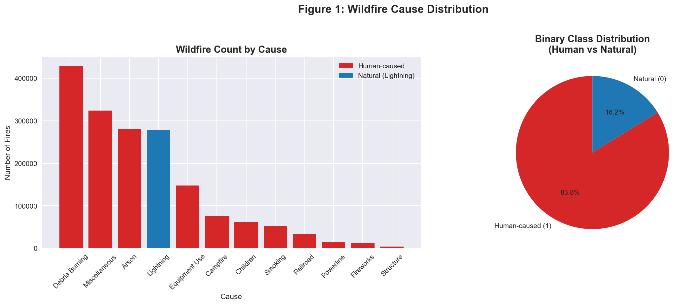

---

## Class Imbalance

The 5.2:1 ratio between human and natural fires is the core challenge. Accuracy flatters models that just predict the majority class. We used F1 score as the primary metric because it penalizes both false positives and false negatives, and ROC-AUC to evaluate how well each model separates the two classes across thresholds.

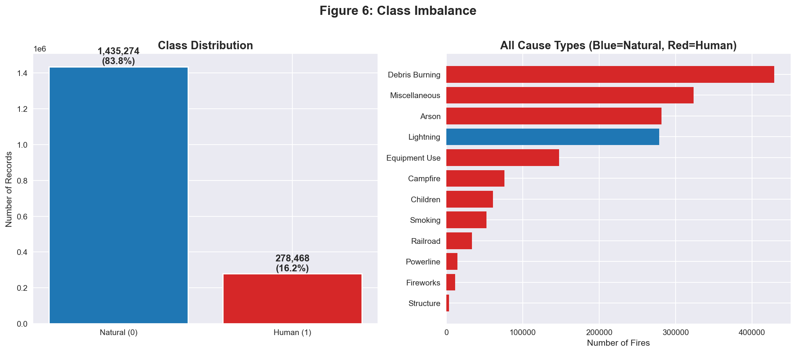

---

## Exploratory Data Analysis

**Geographic distribution** — California, Georgia, and Texas account for the most fires. Lightning-caused fires cluster in the western interior; human-caused fires are concentrated along the coasts and southeast.

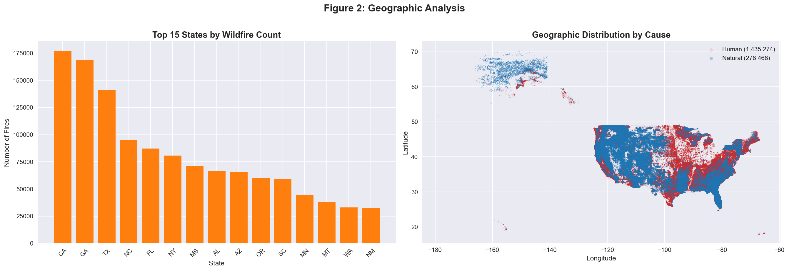

**Temporal patterns** — Fire frequency peaks in spring (March-April) and summer (July-August). Lightning fires spike in summer months. Human-caused fires are spread more evenly across the year.

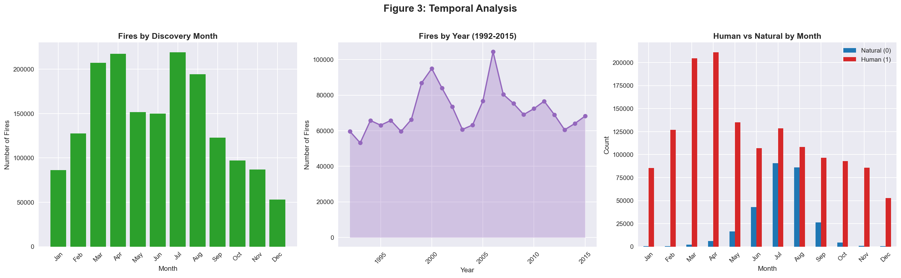

**Fire size** — Most fires are small (Class A and B). Both human and natural fires follow a similar size distribution, so fire size alone is not a reliable predictor of cause.

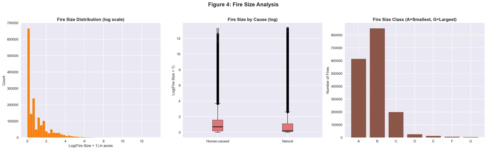

**Correlation heatmap** — Longitude has the strongest correlation with the target (0.34). Latitude is moderately negative (-0.18). Most numeric features are weakly correlated, which is why feature engineering mattered.

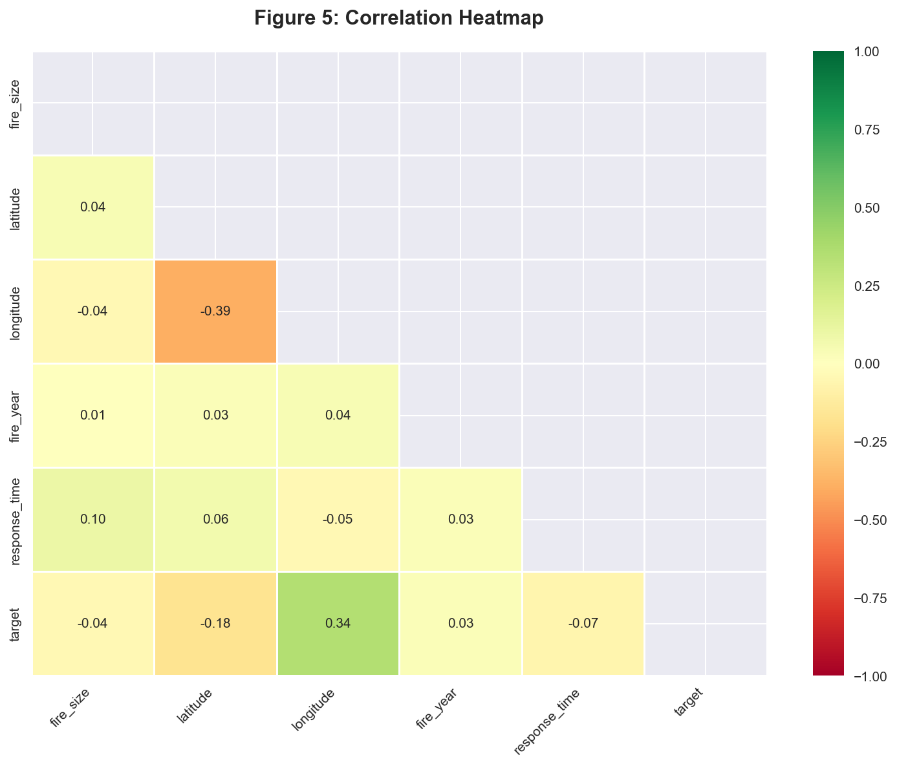

---

## Feature Engineering

12 features total, 5 engineered:

| Feature | Type | Description |
|---|---|---|
| `Season` | Engineered | Spring / Summer / Fall / Winter from discovery month |
| `Is_Drought_Season` | Engineered | Binary flag for high-risk months (June-September) |
| `Region` | Engineered | US geographic region from state |
| `State_Fire_Rate` | Engineered | Historical human-caused fire rate per state |
| `Owner_Type` | Engineered | Land ownership category (federal, state, private) |
| `longitude` | Raw | Strongest individual predictor |
| `latitude` | Raw | Geographic signal for cause |
| `fire_year` | Raw | Year of occurrence |
| `fire_size` | Raw | Acres burned |
| `response_time` | Raw | Days between discovery and containment |
| `discovery_doy` | Raw | Day of year |
| `fire_size_class` | Raw | USDA size category A-G |

---

## Models and Results

All models trained on 80/20 train-test split with stratification. KNN was run on a 100K sample due to compute constraints.

| Model | Accuracy | Precision | Recall | F1 Score | ROC-AUC |
|---|---|---|---|---|---|
| Logistic Regression | 0.810 | 0.961 | 0.805 | 0.876 | 0.883 |
| SVM (LinearSVC) | 0.808 | 0.961 | 0.804 | 0.875 | 0.882 |
| KNN (k=15, 100K sample) | 0.909 | 0.931 | 0.959 | 0.945 | 0.922 |
| Decision Tree (max_depth=5) | 0.858 | 0.963 | 0.862 | 0.910 | 0.914 |
| Random Forest (baseline) | 0.933 | 0.950 | 0.969 | 0.959 | 0.955 |
| **Random Forest (tuned)** | **-** | **-** | **-** | **0.9598** | **-** |

CV mean for tuned RF: 0.9590

---

## Visualizations

**Logistic Regression**
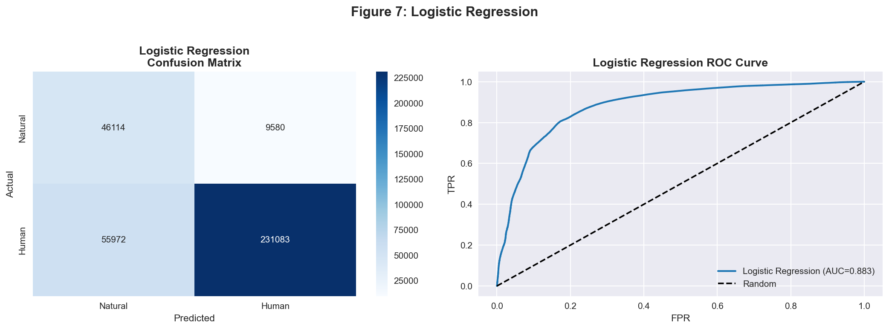

**SVM (LinearSVC)**
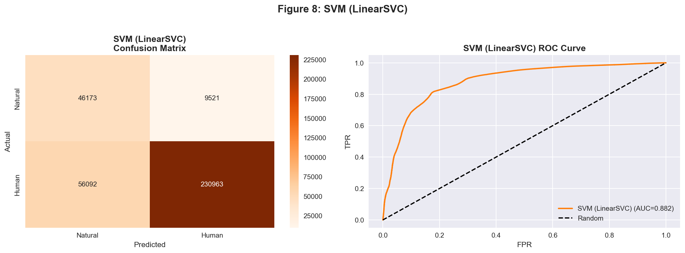

**KNN (k=15)**
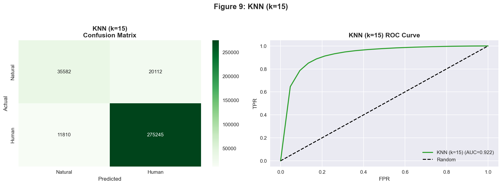

**Decision Tree — Confusion Matrix and ROC**
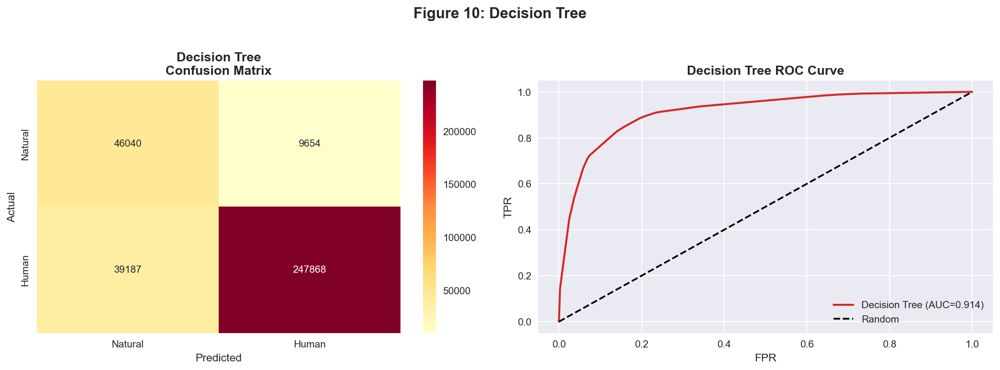

**Decision Tree — Structure (top 3 levels)**
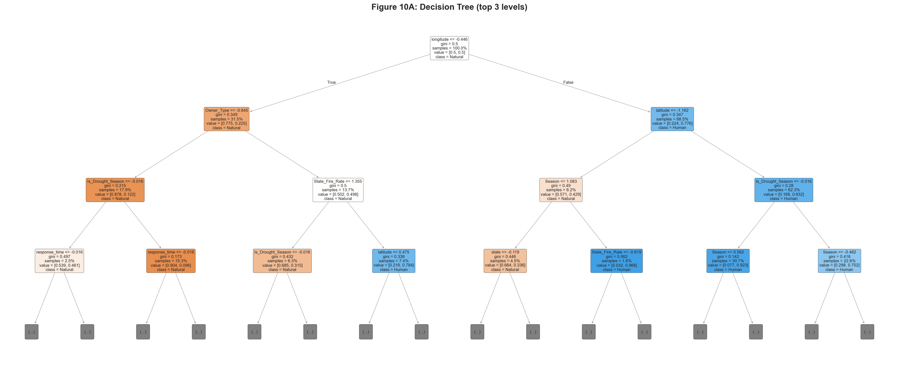

**Random Forest (baseline)**
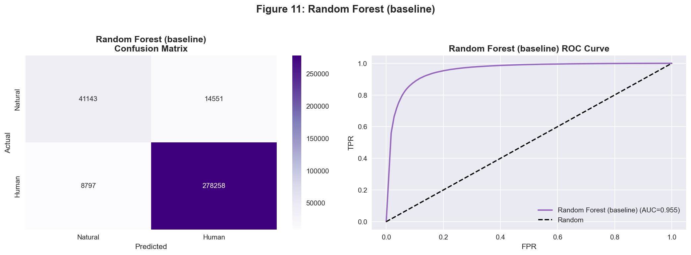

**Baseline Model Comparison**
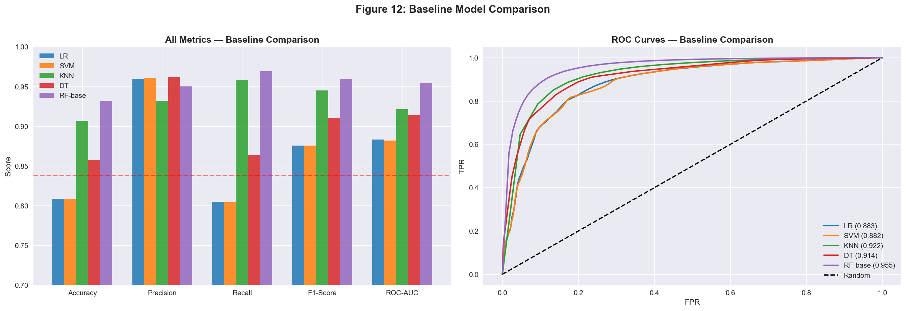

---

## Repo Structure

```
Wildfire-Cause-Prediction/
├── WILDFIRE_FINAL.ipynb                           # Main notebook — all 5 models
├── INFO6105_Team_6_Report.docx                    # Full project report
├── Wildfire-Cause-Prediction-Using-ML-Team6.pptx  # Presentation slides
├── dataset_link.txt                               # Dataset download link
├── Images/                                        # All 13 visualization plots
└── README.md
```

---

## How to Run

1. Download the dataset using the link in `dataset_link.txt`
2. Place the file in the project root
3. Open `WILDFIRE_FINAL.ipynb` in Jupyter Notebook
4. Update the file path in the data loading cell to match your local path
5. Run all cells in order

The notebook requires: `pandas`, `numpy`, `scikit-learn`, `matplotlib`, `seaborn`

---

## Team

| Name | Role |
|---|---|
| Akshay Govind | Feature engineering, model training, EDA, notebook |
| Varun Singh | Data preprocessing, analysis, report |

---

*INFO 6105 — Northeastern University, Spring 2026*
